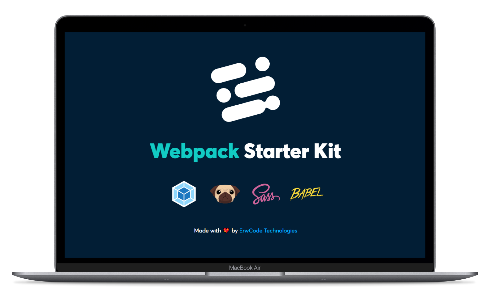

# Webpack Starter Kit Workflow

[![node][node]][node-url]
[![npm][npm]][npm-url]
[![MIT License][mit-license-image]][mit-license-url]
[![GitHub contributors][contributors]][contributors-url]
![GitHub package.json version][version-url]


This Webpack starter kit comes with several tools and opinionated choices for your front-end development projects.



> A starter kit workflow using Webpack, PUG, SCSS, SMACSS-ITCSS, BEM, PostCSS & Babel.

## Installation & Use

Substitute `my-project` for your real project name.

Clone the repository

```sh
 git clone https://github.com/erwcode/webpack-starter-kit.git my-project
 cd my-project
```

Install npm dependencies

```sh
 npm install
```

### Copyright © ErwCode Technologies. All rights reserved

Made with 💖 by [ErwCode Technologies](https://erwcode.com/).


[npm]: https://img.shields.io/npm/v/webpack.svg
[npm-url]: https://npmjs.com/package/webpack

[node]: https://img.shields.io/node/v/webpack.svg
[node-url]: https://nodejs.org

[mit-license-image]: https://img.shields.io/github/license/erwcode/webpack-starter-kit.svg
[mit-license-url]: https://github.com/erwcode/webpack-starter-kit/blob/master/LICENSE

[contributors]: https://img.shields.io/github/contributors/erwcode/webpack-starter-kit.svg?color=orange
[contributors-url]: https://github.com/erwcode/webpack-starter-kit/graphs/contributors

[version-url]: https://img.shields.io/github/package-json/v/erwcode/webpack-starter-kit.svg?color=red
